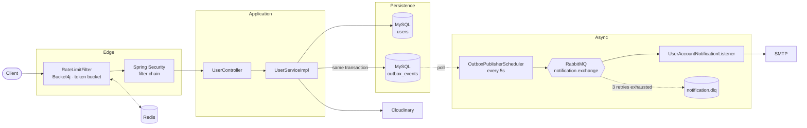

# Spring Boot Blueprint

A production-shaped Spring Boot backend built to explore the patterns that separate a real service from a CRUD demo — transactional outbox messaging, distributed rate limiting, soft-delete lifecycles, and OTP email verification.

[](https://github.com/maaitlunghau/spring-boot-blueprint/actions/workflows/ci.yml)


---

## Why this project exists

Most portfolio backends stop at `save()` and `findAll()`. The interesting problems start right after: what happens when the database commit succeeds but the message broker is down? How do you change a rate limit without the old config sticking around in Redis forever? How do you delete a user without losing the ability to undo it — or leaking their email address to the next person who registers?

This repository is where I work through those questions one feature at a time. Every subsystem here was designed before it was written (design specs live in [`docs/superpowers/specs/`](docs/superpowers/specs/)) and verified end-to-end against real infrastructure — real RabbitMQ, real SMTP, real Cloudinary, real MySQL schema diffs.

It is a **learning project, built to production standards** — not a product. See [Project status](#project-status) for an honest account of what that does and doesn't mean.

---

## Architecture at a glance



The key line in that diagram is **`same transaction`**: a state change and its intent to notify are committed atomically. Nothing is published to RabbitMQ from inside a service method.

---

## Feature highlights

### User lifecycle
Full CRUD plus the states a real user account actually moves through — with each transition publishing an event and triggering an email.

| Capability | Endpoint | Notes |
|---|---|---|
| Filtered search | `GET /api/users` | 10 composable filter params via JPA Specifications, paginated |
| Ban / unban | `PATCH /api/users/{id}/ban` · `/unban` | Temporary bans auto-expire via scheduler |
| Soft delete / restore | `DELETE /api/users/{id}` · `PATCH .../restore` | 30-day retention, then auto-purge |
| Permanent purge | `DELETE /api/users/{id}/purge` | Cascades to tokens, cleans up remote assets |
| Avatar upload | `POST /api/users/{id}/avatar` | Normalized to 512×512, face-cropped |
| Email verification | `POST /api/users/{id}/verify-email` | 6-digit OTP, BCrypt-hashed at rest |

Full request/response contracts: **[`docs/API_REFERENCE.md`](docs/API_REFERENCE.md)** · Live Swagger UI at `/swagger-ui/index.html`.

### Transactional outbox messaging
State changes write a `PENDING` row to `outbox_events` inside the same transaction as the business write. A scheduler polls and publishes to RabbitMQ, tracking retry count and last error, marking `FAILED` after 5 attempts. This eliminates the dual-write problem: there is no window where the database says "banned" but the notification was silently lost.

Consumer side gets a retry chain (3 attempts with backoff) terminating in a dead-letter queue — verified by pointing the app at deliberately broken SMTP credentials and watching messages land in `notification.dlq`.

### Distributed rate limiting
Token-bucket limiting via Bucket4j backed by Redis, enforced in a servlet filter that runs **before** the entire Spring Security chain — rejection costs nothing but a Redis round trip. Policy is a plain rule list matched with `AntPathMatcher`, with per-endpoint tiers from 100/min down to 3/min for avatar uploads.

### Provider-agnostic integrations
Every third-party service sits behind a minimal interface in `common/`. `CloudinaryStorageService`, `RabbitEventPublisher`, and `SmtpEmailService` are the *only* classes permitted to import their vendor's SDK — swapping providers touches one file, not every caller.

---

## Engineering decisions worth reading

These are the calls that took real investigation. Each one is a bug I hit, diagnosed, and fixed — not a pattern copied from a tutorial.

<details>
<summary><b>Rolling back a transaction silently defeated the brute-force guard</b></summary>

`verifyEmail` incremented an OTP attempt counter, saved it, then threw `InvalidOtpException` for a wrong code. Spring rolls back on unchecked exceptions by default — so the increment was discarded every single time. `attempt_count` sat at `0` forever and the 5-attempt lockout never triggered.

Found by querying the database directly after six deliberate wrong guesses, rather than trusting the code path. Fixed with `@Transactional(noRollbackFor = InvalidOtpException.class)`.

**Takeaway now encoded in the project's coding standards:** any failure path that records state before throwing needs the exception named in `noRollbackFor`.
</details>

<details>
<summary><b>Changing a rate limit in code did nothing</b></summary>

Lowering the avatar tier from 10/min to 3/min had no effect — a fourth request still succeeded. Bucket4j only evaluates the configuration supplier the *first* time a Redis key is created; existing buckets keep running on whatever config they were born with.

Root-caused by finding the stale key with `redis-cli KEYS`. Fixed with `withImplicitConfigurationReplacement(version, TokensInheritanceStrategy.RESET)` and a `configVersion` field on every rule that must be bumped when limits change.
</details>

<details>
<summary><b>Publishing pre-serialized JSON through a message converter double-encoded it</b></summary>

The outbox stores payloads as JSON text. Passing that `String` through `convertAndSend(...)` serialized it *again*, so consumers received a JSON-encoded string containing JSON.

`EventPublisher.publish` therefore takes a `String`, not `Object`, and builds a raw `Message` with `content_type=application/json`. Verified through the RabbitMQ Management API that the payload lands un-double-encoded.
</details>

<details>
<summary><b>Timestamps came back null from the create endpoint</b></summary>

`createUser` mapped the entity to a DTO immediately after `save()` and got `createdAt: null`. Hibernate's `@CreationTimestamp` is a deferred generator — it only populates at flush time.

Switched to Spring Data JPA Auditing (`@CreatedDate` + `AuditingEntityListener`), which runs in `@PrePersist` synchronously inside `persist()`. Plain `save()` now works with no `saveAndFlush()` anywhere in the codebase.
</details>

<details>
<summary><b>Spring Boot 4 dropped the retry API every tutorial still references</b></summary>

Spring AMQP 4.1.0 no longer uses the external `spring-retry` library — it ships its own `RetryInterceptorBuilder` built on Spring Framework 7's `org.springframework.core.retry.RetryPolicy`, and the old one is binary-incompatible with `RejectAndDontRequeueRecoverer`.

Diagnosed by running `javap` against the compiled class in the local Maven repository to read its actual implemented interface, rather than guessing the replacement from memory. The same technique resolved deprecations in `Jackson2JsonMessageConverter` and `Bandwidth.simple(...)`.
</details>

<details>
<summary><b>The dev schema silently lacked a foreign key that production would have</b></summary>

`email_verification_tokens.user_id` is a plain column, not a `@ManyToOne` — deliberately, to avoid lazy-loading concerns. But that means `ddl-auto=update` generates the table with **no FK constraint at all**, so the `ON DELETE CASCADE` that `purgeUser` depends on didn't exist locally.

Verified by dropping the Hibernate-created table, piping the real migration SQL into MySQL by hand, restarting, and re-testing purge. Every migration in this repo is checked against live `ddl-auto` output before being written — which is also how a `VARCHAR` vs. MySQL `ENUM(...)` mismatch got caught earlier.
</details>

---

## Tech stack

| Layer | Choice | Why |
|---|---|---|
| Runtime | Java 21, Spring Boot 4.1.0 | Records, pattern matching, virtual-thread-ready |
| Web | `spring-boot-starter-webmvc` | Renamed from `-web` in Boot 4 |
| Persistence | Spring Data JPA · Hibernate · MySQL 8.4 | |
| Migrations | Flyway (`V1`–`V8`) | `validate` in prod, `update` in dev |
| Cache / limiting | Redis 7 · Bucket4j 8.10 | Raw Lettuce client — Bucket4j needs it directly |
| Messaging | RabbitMQ 3 · Spring AMQP | Topic exchange, per-event queues, DLX + DLQ |
| Mail | `spring-boot-starter-mail` | Real SMTP, no dev mail-catcher |
| Storage | Cloudinary | Behind `StorageService` — the only vendor-coupled class |
| Security | Spring Security · BCrypt | JWT layer not yet built |
| Mapping | MapStruct 1.6 | Compile-time, no reflection |
| Docs | springdoc-openapi 3.1 | Swagger UI at `/swagger-ui/index.html` |
| IDs | `uuid-creator` (UUIDv7) | Time-sortable, index-friendly |
| JSON | **Jackson 3** (`tools.jackson.*`) | Boot 4's new default |

---

## Getting started

### Prerequisites
Docker · JDK 21 · a Cloudinary account and SMTP credentials (for avatar upload and email features)

### Run it

```bash
git clone https://github.com/maaitlunghau/spring-boot-blueprint.git
cd spring-boot-blueprint

cp .env.example .env        # then fill in real credentials
docker compose up -d        # mysql + redis + rabbitmq

set -a; source .env; set +a # .env isn't auto-loaded in non-interactive shells
./mvnw spring-boot:run
```

```bash
curl "http://localhost:8081/api/users?size=1"
```

| Service | URL |
|---|---|
| API | `http://localhost:8081` |
| Swagger UI | `http://localhost:8081/swagger-ui/index.html` |
| RabbitMQ management | `http://localhost:15672` |
| phpMyAdmin | `http://localhost:8080` (needs `--profile dev`) |

### Other commands

```bash
./mvnw test                             # test suite
./mvnw clean package -DskipTests        # build target/app.jar
docker build -t spring-boot-blueprint . # multi-stage image, non-root runtime user
```

---

## Project structure

```
src/main/java/com/maaitlunghau/spring_boot_blueprint/
├── common/
│   ├── dto/              ApiResponse<T>, PageResponse<T> — every response is enveloped
│   ├── entity/           BaseEntity: UUIDv7 id, auditing timestamps, @Version
│   ├── messaging/        EventPublisher + outbox/ (transactional outbox)
│   ├── notification/     EmailService + SMTP implementation
│   ├── persistence/      @HasUuidV7 + generator
│   └── storage/          StorageService + Cloudinary implementation
├── config/               Security, OpenAPI, RabbitMQ topology, rate-limit policy, scheduling
├── exception/            AppException hierarchy + one GlobalExceptionHandler
├── filter/               RateLimitFilter — runs ahead of the Security chain
├── module/
│   ├── user/             controller · dto · entity · event · mapper · repository · service
│   ├── notification/     RabbitMQ listeners (event-driven, not CRUD)
│   └── auth/             scaffolded, not yet implemented
├── scheduler/            outbox publishing, ban expiry, retention purge
├── security/             empty — reserved for the auth module
└── util/                 empty
```

Every CRUD module follows the same internal layout. Services are always interface + `impl/`; controllers depend on the interface. Entities have no setters — mutation happens through named business methods (`ban(...)`, `softDelete()`, `changeRole(...)`) so invariants stay inside the entity.

---

## Conventions

- **Uniform envelope** — every response, success or error, is an `ApiResponse<T>` with `status`, `message`, `data`, `timestamp`. No endpoint returns a bare DTO or a bare `204`.
- **`Instant`, never `LocalDateTime`** — for instant-semantic fields. `LocalDateTime` serializes without an offset, which clients can't parse unambiguously across timezones. Paired with `hibernate.jdbc.time_zone: UTC` so storage doesn't depend on the JVM's default zone.
- **UUIDv7 primary keys** — time-sortable, so they don't fragment indexes the way UUIDv4 does.
- **No DB connection held across network I/O** — service methods that mix a database write with a slow external call use `@Transactional(propagation = NOT_SUPPORTED)`; the repository calls inside still get their own short transactions.
- **Best-effort external cleanup** — deleting an orphaned remote asset is wrapped in `try/catch` and logged, never allowed to fail the request that already succeeded.
- **Conventional commits**, enforced by a Husky `commit-msg` hook: `type(scope): subject`, single line, ≤70 characters.

---

## Testing & CI

GitHub Actions runs on every push and PR to `main`: a `test` job spins up MySQL, Redis, and RabbitMQ as service containers and runs the suite, followed by a `docker-build` job that proves the image still builds.

**Automated test coverage is currently minimal** — one context-load test. Every feature listed above was verified manually and end-to-end against real infrastructure: real RabbitMQ queues inspected through the Management API, real emails delivered, deliberately-broken SMTP credentials used to confirm messages reach the DLQ, schedulers tested by temporarily shortening their intervals, rate limits confirmed with `curl` loops, and database state checked directly after each failure path.

That verification was thorough, but it isn't repeatable by anyone but me, and it doesn't catch regressions. **Building a real test suite is the top item on the roadmap** — see below.

---

## Project status

Active learning project. The `user` module is complete; the `auth` module is the next major piece of work.

**Current limitations, stated plainly:**

| | |
|---|---|
| 🔴 **Security is open** | `SecurityConfig` is temporarily `.anyRequest().permitAll()` for hands-on testing. It must return to `.authenticated()` before this work merges. |
| 🔴 **No automated tests** | One context-load test. See [Testing & CI](#testing--ci). |
| 🟡 **No authentication** | No JWT, no login endpoint. Role-based rules like "ban is admin-only" are documented but unenforced. |
| 🟡 **Deferred gaps tracked** | Eight items blocked on authenticated-caller identity — self-ban prevention, per-user rate limiting, request-time ban enforcement — are catalogued in [`docs/AUTH_MODULE_TODO.md`](docs/AUTH_MODULE_TODO.md) rather than forgotten. |
| 🟡 **No CORS config** | Fine for mobile clients; blocks browser-based ones. |
| ⚪ **No deployment target** | The CD workflow is a deliberate no-op placeholder. |

### Roadmap

- [ ] Automated test suite — integration tests with Testcontainers, unit tests for service logic
- [ ] Auth module — JWT access/refresh tokens, working through the deferred-gaps checklist
- [ ] Method-level authorization (`@PreAuthorize`) across admin-only endpoints
- [ ] Redis caching (`@Cacheable`) — currently Redis only backs rate limiting
- [ ] Flutter client consuming this API ([maaitlunghau/flutter](https://github.com/maaitlunghau/flutter))

---

## Documentation

| Document | Contents |
|---|---|
| [`docs/API_REFERENCE.md`](docs/API_REFERENCE.md) | All 14 endpoints — contracts, validation rules, status codes, client examples |
| [`docs/AUTH_MODULE_TODO.md`](docs/AUTH_MODULE_TODO.md) | Every gap deferred until authentication exists, with the reasoning |
| [`docs/superpowers/specs/`](docs/superpowers/specs/) | Design documents written before each feature was built |

---

## Author

**Mai Trung Hau** — [@maaitlunghau](https://github.com/maaitlunghau)

Built to learn the parts of backend engineering that don't fit in a tutorial.
